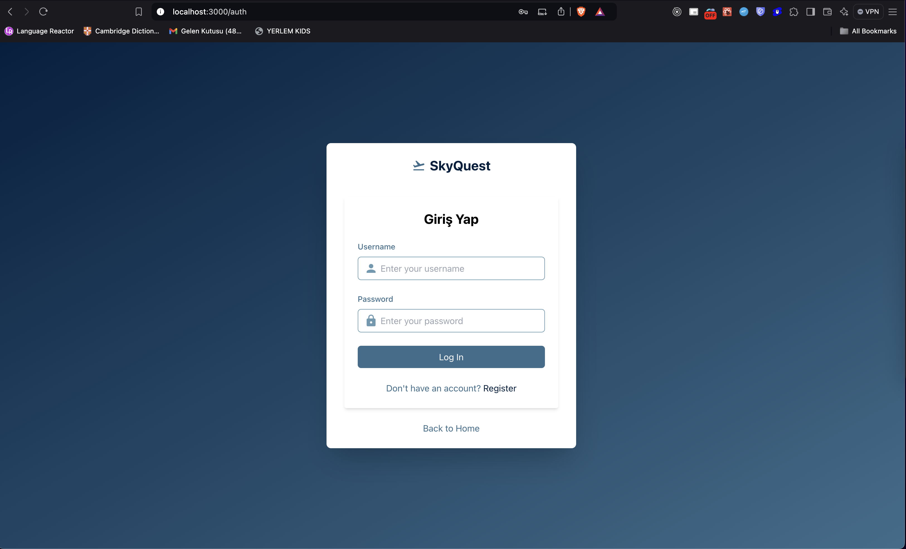
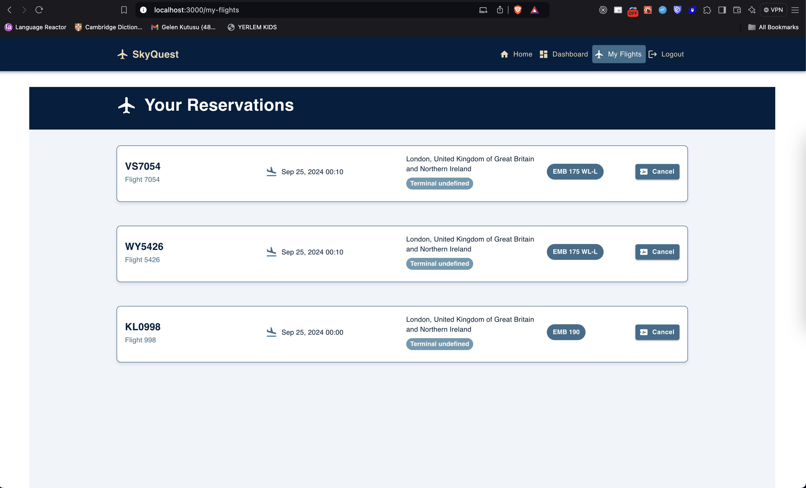
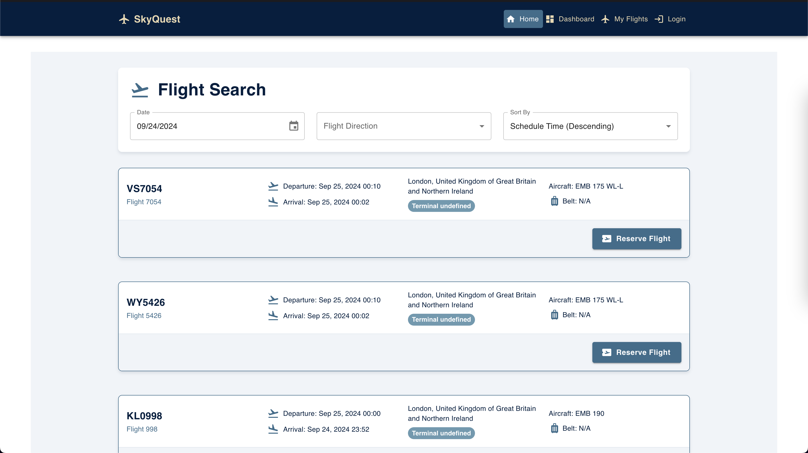
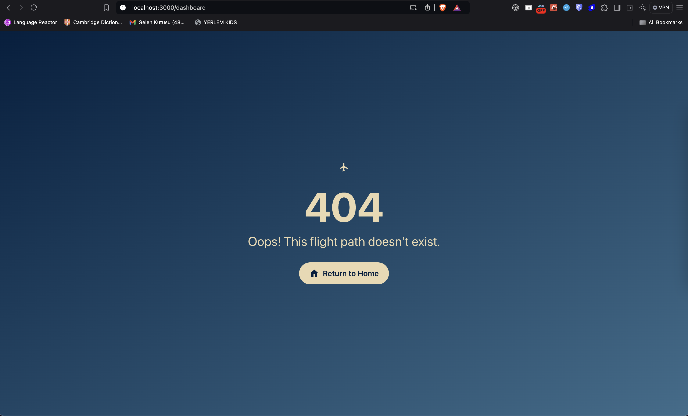

# Flight Information and Booking System (SKYQUEST)

This project is a comprehensive flight information and booking system using React for the frontend, NestJS for the backend, and MongoDB for the database.

## Project Structure

```
├── client
├── server
├── docker-compose.yml
├── mongo-init.js
└── README.md
```

- [Client README](./client/README.md)
- [Server README](./server/README.md)
## Project Images






## Prerequisites

- Docker
- Docker Compose

## Setup and Installation

1. Clone the repository:

   ```
   git clone <repository-url>
   cd <project-directory>
   ```

2. Create a `.env` file in the `server` directory with the following content:

   ```
   SCHIPHOL_APP_ID=0e1beef2
   SCHIPHOL_APP_KEY=e92a321b1782e47f99b0c719e86b4be4
   JWT_SECRET=AppFellas
   ```

3. Start the application using Docker Compose:

   ```
   docker-compose up -d
   ```

4. The application will be available at:
   - Frontend: http://localhost:3000
   - Backend: http://localhost:5002
   - MongoDB Express (Database GUI): http://localhost:8081

## Docker Networks

This project uses a custom Docker network named `network`. All services (client, server, db, and mongo-express) are connected to this network, allowing them to communicate with each other.

To inspect the network:

```
docker network inspect network
```

## Services

- **Client**: React frontend application
- **Server**: NestJS backend application
- **DB**: MongoDB database
- **Mongo Express**: Web-based MongoDB admin interface

## Environment Variables

The following environment variables are used in the project:

- `SCHIPHOL_APP_ID`: Application ID for Schiphol API
- `SCHIPHOL_APP_KEY`: Application Key for Schiphol API
- `JWT_SECRET`: Secret key for JWT token generation

These variables are stored in the `.env` file in the `server` directory.

## Contributing

Please read [CONTRIBUTING.md](CONTRIBUTING.md) for details on our code of conduct, and the process for submitting pull requests to us.

## License

This project is licensed under the MIT License - see the [LICENSE.md](LICENSE.md) file for details.
